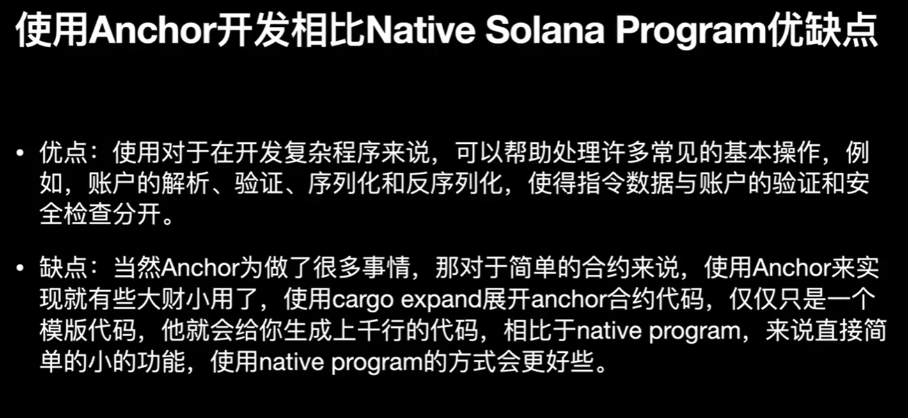
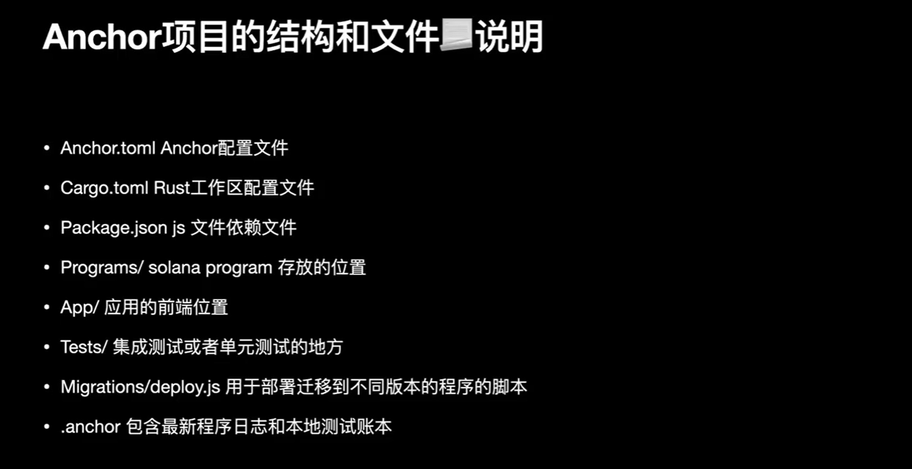

## 什么是Anchor

## Anchor项目结构

## Anchor合约框架解析

## macros 宏
Anchor 框架包含了许多macros宏，这些宏为我们的程序生成 Rust 模板代码以及相应的安全校验。这里主要用到的宏是: 
● declare_id!: 声明程序地址。该宏创建了一个存储程序地址program_id的字段，你可以通过一个指定的program_id访问到指定的链上程序。
● #[program]: 程序的业务逻辑代码实现都将在#[program]模块下完成。
● #[derive(Accounts)]: 由于Solana 账户模型的特点，大部分的参数将以账户集合的形式传入程序，在该宏修饰的结构体中定义了程序所需要的账户集合。
● #[account]：该宏用来修饰程序所需要的自定义账户。
